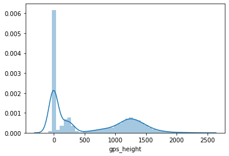
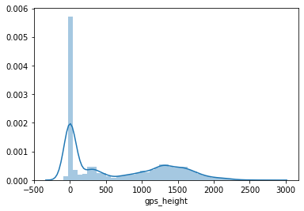
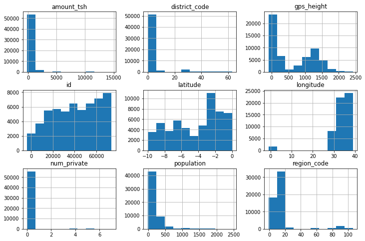
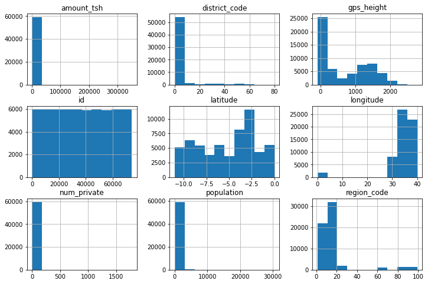

# Synthesizing tablar data

## Intro 
- Through out my time learning I have always heard of data scientist complain of the lack of labeled data.  They say it would power there machine learning algo or they would be able to predict better with the access to better and more data.  So I sought out to find a soulution to that issue.  I was able to find a Generaitive model called a CTGAN that was remarkable at synthesiszing data with extermly high accuracy.

# Project Summary 
-  I found that the CTGAN was great at generating data.  It was able to produce with simalar, almost identical distriubutions.  This led to higher then expected results when using the synthetic data as training data for models. Also you can decided how many samples you would like to generate for your synthetic dataset which offers great flexibility.  Almost always more data the better, so I found the datasets with higher amount of instances scored better accuracy then models with less data.

# Data
- The data used was form a well classification dataset.  The task at hand was to classifiy rather a well was functional, non-functional, or in need of repair.  It had 59,000 rows over 30 columns. Please find the features below.

- amount_tsh - Total static head (amount water available to waterpoint)
- date_recorded - The date the row was entered
- funder - Who funded the well
- gps_height - Altitude of the well
- installer - Organization that installed the well
- longitude - GPS coordinate
- latitude - GPS coordinate
- wpt_name - Name of the waterpoint if there is one
- num_private -
- basin - Geographic water basin
- subvillage - Geographic location
- region - Geographic location
- region_code - Geographic location (coded)
- district_code - Geographic location (coded)
- lga - Geographic location
- ward - Geographic location
- population - Population around the well
- public_meeting - True/False
- recorded_by - Group entering this row of data
- scheme_management - Who operates the waterpoint
- scheme_name - Who operates the waterpoint
- permit - If the waterpoint is permitted
- construction_year - Year the waterpoint was constructed
- extraction_type - The kind of extraction the waterpoint uses
- extraction_type_group - The kind of extraction the waterpoint uses
- extraction_type_class - The kind of extraction the waterpoint uses
- management - How the waterpoint is managed
- management_group - How the waterpoint is managed
- payment - What the water costs
- payment_type - What the water costs
- water_quality - The quality of the water
- quality_group - The quality of the water
- quantity - The quantity of water
- quantity_group - The quantity of water
- source - The source of the water
- source_type - The source of the water
- source_class - The source of the water
- waterpoint_type - The kind of waterpoint
- waterpoint_type_group - The kind of waterpoint

# Model Results
- This model did very well the, the distruibutions for the features below are almost identical.  They are just off a litte because of scaling. It accounts for outliers as well as distributions and means, medians, and modes.

- Synthetic Data

- 

- Real data

- Synth Data

- Real Data

### Results of Training with Synthetic Dataset and Real Training Dataset on Pump It dataset
- Classifing Wells:
- Synth with 56,000 rows  = 72%
- Real with 59,4000 rows = 80%

# Recommendations
- If you are short on data or do not have the funds to complete a project, data generations is a must.  You can generate as big of a dataset as needed with nearly the same properties of the inital dataset.  Also try and use this GAN on big data to make more more and more data for algorithms.

# Further work
- I would like to combine both the synth dataset and the real training dataset and see how the classification or regression preform
- I would like to try this frame work on a much larger platform such as SQL or Spark
- I would want to see what the more rows I can generate 
- I would like to see if in fact the more rows the better performance 
